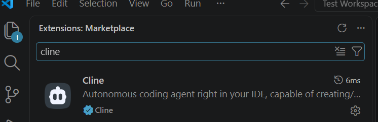
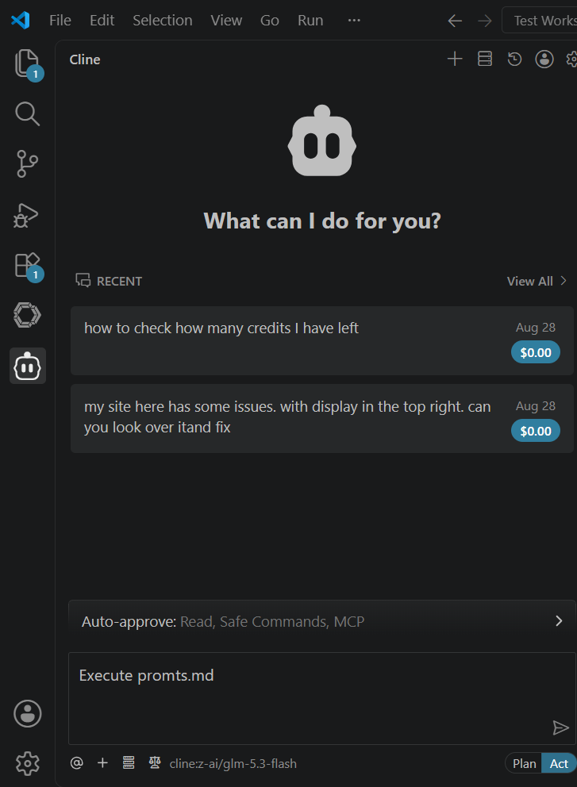
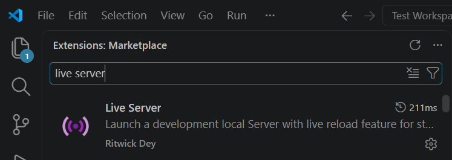
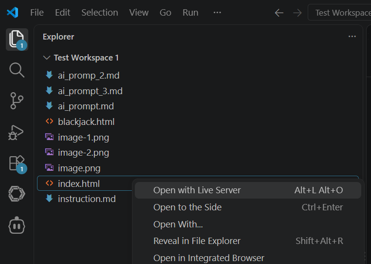

# Instruction
## Third Meeting of TN-AI
1. Install VSCode
2. Install extension Cline (this is easier to setup than Continue that we tried next time)

3. Register using school email, aggree to everything. Use glm-5.3-flash free modl.
4. Create a new folder in your preferred work directory. 
5. Open it in VSCode.
6. Create prompts.md file with the following content
```
# My Site Project
- Create a placeholder site using html+css+javascripts.
- Don't use fancy graphics [will be changed later].
- Input greeting for me. My name is Input Name.
- Create a button that gives random greeting.
```
7. Ask Cline to execute prompts.md

8. Install extension Live Server

9. Right click on index.html that was generated by cline and Open with Live Server to test your site.

10. Now make something more creative quickly. Enjoy!