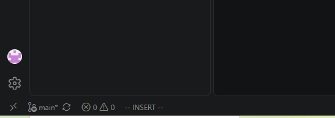
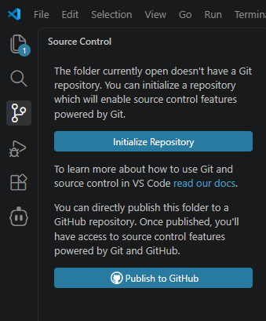
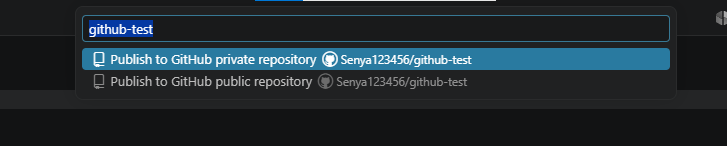
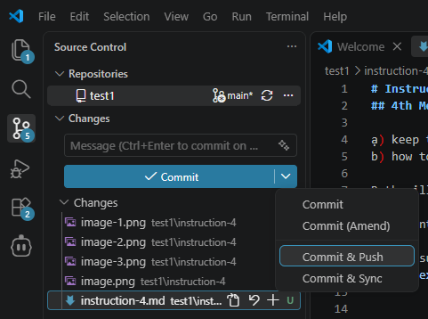
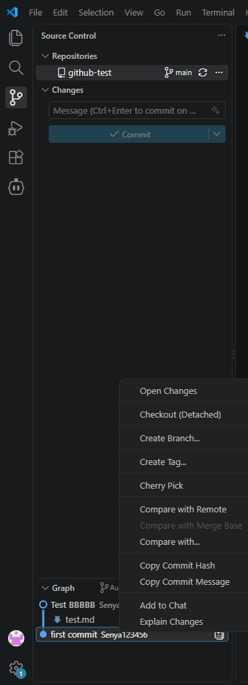

# Instruction
## 4th Meeting of TN-AI
Whether you program the old way, using ai agent or ai chat, git(hub) is a must in modern development.
ạ) keep track of project versions so you can revert unwanted changes if needed. (focus of today)
b) how to share your project with everybody if you wish so.
c) Colllaborate with others.

all this is vailable will work through the GitHub site, which is professional standard for modern coders.

1. Log into github

2. Make sure you are logged in to github in your vs-code (left bottom corner)

3. click on github icon on the left panel, press "Publish to Github"

4. Confirm at the top of the screen (Note: use private repository, so it can be published on free site hosting later. obvously, dont reveal any private information in there)

5. When you like changes to your site, you can press commit and push on github. The changes can always be rolled back.

6. actual rolling back could be a bit complicated, you can use command "reset to [insert hash code, see screenshot], push to github" to Cline, or call Mr. Arsenii for help.

7. From github, it will be easy to publish your site for everybody to test. You just need to make your github project public through Settings, then publish site through Settings->Pages.

8. Go back to working on some project. Tip (for full brainless mode): you can use AI chatbot like deepseek or chat gpt to generate ideas, then develop them, then generate Cline prompt, jsut describe your situation. Example: "I want to create a site with simple car racing game. I am using VSCode with Cline. Give me  a shortsequence of Cline prompts to make this happen.", You can save the prompts in prompts.md file for later refernce.

